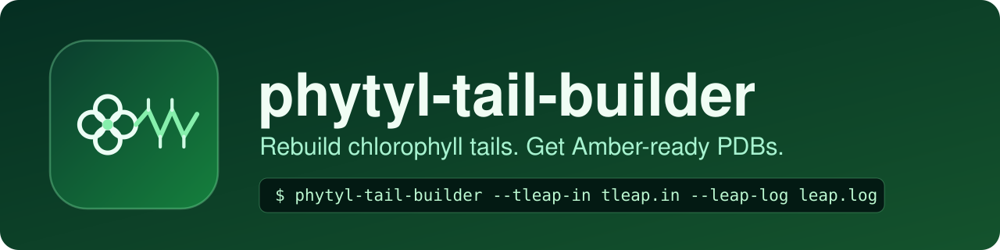
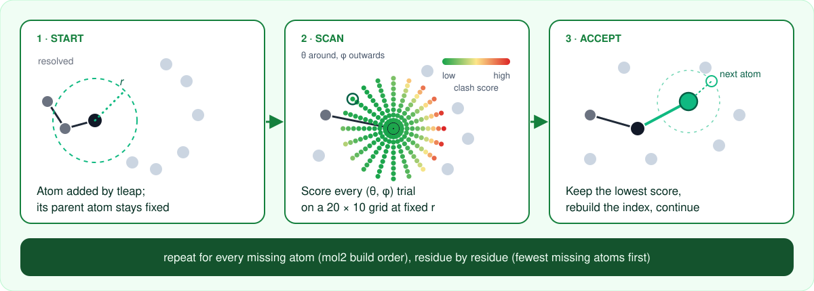
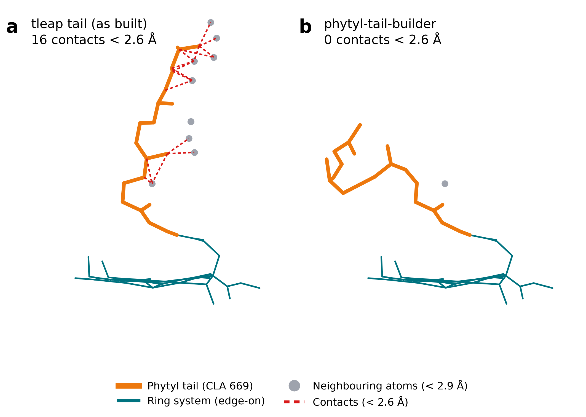

<p align="center">
  
</p>

<p align="center">
  
  
  
</p>

**phytyl-tail-builder** reconstructs the phytyl tails of chlorophylls (and other cofactors with long side chains) that are truncated in cryo-EM or X-ray models. It reads the log of an Amber `tleap` run, finds the heavy atoms that `tleap` had to add, and places them one by one at the position with the fewest steric clashes. The result is a PDB file that you load back into `tleap` to add hydrogens and build your topology.

It was developed in the Mennucci and Cupellini groups at the Università di Pisa to prepare the LHCII–CP29–CP24 model of Photosystem II.

## Install

```bash
git clone https://github.com/ViktorVanVaughn/phytyl-tail-builder.git
cd phytyl-tail-builder
pip install .
```

Python 3.9 or newer. The only dependencies are `numpy` and `scipy`.

## Quick start

Run it in the folder where you ran `tleap`, with two arguments:

```bash
phytyl-tail-builder --tleap-in tleap.in --leap-log leap.log
```

```
usage: phytyl-tail-builder [-h] --tleap-in TLEAP_IN --leap-log LEAP_LOG
                           [--templates TEMPLATES] [-o OUTPUT_PREFIX]
                           [--tail-potential {lj,mie}]
                           [--environment-potential {lj,mie}] [--keep-tleap-positions]
                           [-v] [--version]

Reposition tail atoms added by tleap and write a hydrogen-free PDB.

options:
  -h, --help            show this help message and exit
  --tleap-in TLEAP_IN   tleap input script that was run
  --leap-log LEAP_LOG   leap.log written by that run
  --templates TEMPLATES
                        folder with <RESNAME>.mol2 templates (default: folder of
                        --tleap-in)
  -o OUTPUT_PREFIX, --output-prefix OUTPUT_PREFIX
                        output folder (default: current directory)
  --tail-potential {lj,mie}
                        potential between a new atom and the tail atoms already placed
                        (lj: Lennard-Jones 12-6, mie: Mie 16-6; default: lj)
  --environment-potential {lj,mie}
                        potential between a new atom and everything else (default:
                        mie)
  --keep-tleap-positions
                        keep the tleap positions of the residue's added atoms in the
                        environment while the tail is built
  -v, --verbose         verbose logging
  --version             show program's version number and exit
```

| Option | Meaning |
|---|---|
| `--tleap-in` | The `tleap.in` script you ran. Its `loadpdb` and `savepdb` lines give the input and output structures. |
| `--leap-log` | The `leap.log` it produced. Its `Added missing heavy atom` lines say which atoms to place. |
| `--templates DIR` | Folder with one `<RESNAME>.mol2` per residue type (default: the folder of `tleap.in`). |
| `--tail-potential {lj,mie}` | Potential between a new atom and the tail atoms already placed (default: `lj`). |
| `--environment-potential {lj,mie}` | Potential between a new atom and everything else (default: `mie`). |
| `--keep-tleap-positions` | Keep the tleap positions of the residue's added atoms in the environment while the tail is built. |
| `-o, --output-prefix DIR` | Where to write the result (default: current directory). |
| `-v` | Verbose logging. |

A small worked example is in [`examples/`](examples):

```bash
cd examples/minimal
phytyl-tail-builder --tleap-in tleap.in --leap-log leap.log
```

Then rebuild hydrogens and parameters in `tleap` using the new file, for instance with [`examples/tleap_rebuild.in`](examples/tleap_rebuild.in):

```
LCC = loadpdb LCC_no_sc_no_Hy.pdb
```

## Inputs and output

**Inputs**

- `tleap.in` with a `loadpdb` line (the structure before `tleap`) and a `savepdb` line (the structure after `tleap`).
- `leap.log` from running that script.
- One `<RESNAME>.mol2` template per residue type that received new atoms (for example `CLA.mol2` and `CHL.mol2`). The template gives the bonds and the order in which the atoms of the tail are built.

**Output**

`<name>_no_Hy.pdb`: the structure after `tleap`, with hydrogens removed from the rebuilt residues and every added atom moved to its best position. Hydrogens are added back when you load it into `tleap`.

## How it works

<p align="center">
  
</p>

1. **Find the atoms to place.** The atoms that `tleap` added are read from `leap.log`. Their connectivity and build order come from the `.mol2` template of each residue, so that every tail grows outwards from the atom that is already bonded to the resolved part of the molecule. Residues are processed in order of increasing number of missing atoms.

2. **Scan the directions.** For each atom, the bond length *r* to its parent atom is kept at the force-field value, and the bond direction is scanned over a 20 × 10 grid of the two spherical angles, θ ∈ [0, 2π] and φ ∈ [0, π].

3. **Score every trial position.** Each trial is compared with the atoms already present, found through a `cKDTree` spatial index so that the cost does not grow with the size of the system. Within the fragment, that is the atoms of the tail that are already placed and the atom the tail grows from, contacts are scored with a Lennard-Jones (12–6) term. Contacts with the environment (protein, other cofactors, lipids, and the rest of the molecule) are scored with a Mie (16–6) term. Both use ε = 0.36 and σ = 3.4 Å. The tleap position of the atom being placed, and of the tail atoms still to come, is not part of the environment:

   $$U_\mathrm{LJ}(r) = 4\varepsilon\left[\left(\tfrac{\sigma}{r}\right)^{12} - \left(\tfrac{\sigma}{r}\right)^{6}\right], \qquad U_\mathrm{Mie}(r) \propto \varepsilon\left[\left(\tfrac{\sigma}{r}\right)^{16} - \left(\tfrac{\sigma}{r}\right)^{6}\right]$$

   Only the ranking of the trials matters, so the overall energy scale does not change the result. The two potentials can be swapped with `--tail-potential` and `--environment-potential`.

4. **Adapt the cutoff to the local density.** At each trial position **x** the number of nearby atoms within r₀ = 3.4 Å gives a local density ρ(**x**), and the cutoff is widened to r_cut(**x**) = r₀ [1 + ρ(**x**)]. Crowded pockets are therefore probed further out than open ones, and every pair contribution is weighted by r_cut / r to sharpen the penalty for close contacts.

5. **Accept and continue.** The trial with the lowest total score is accepted, the spatial index is rebuilt with the new position, and the procedure moves to the next atom of the tail.

## Example

A chlorophyll *a* of the minimal example (CLA 669) seen edge-on, as placed by `tleap` (a) and by phytyl-tail-builder (b). The tail leaves the ring system straight; after the rebuild it turns away from the atoms it was overlapping. Grey dots are the neighbouring atoms within 2.9 Å of the tail, and red dashes are contacts closer than 2.6 Å.

<p align="center">
  
</p>

The figure is made with [`scripts/plot_tail.py`](scripts/plot_tail.py) (needs matplotlib):

```bash
cd examples/minimal
python ../../scripts/plot_tail.py LCC_no_sc.pdb expected/default/LCC_no_sc_no_Hy.pdb CLA.mol2 669 -o tail.png --name "CLA 669"
```

## Citation

If you use this code, please cite the associated work:

> Santos, J.; John, C.; Cupellini, L.; Mennucci, B. *Polarizable ML/MM modelling of the excitonic properties of the LHCII-CP29-CP24 subunit of Photosystem II.* Manuscript under review.

GitHub also shows a "Cite this repository" button, which reads [`CITATION.cff`](CITATION.cff).

## Acknowledgements

Group of Benedetta Mennucci and Lorenzo Cupellini, Università di Pisa.


Funded by the European Union. This work was supported by the Marie Skłodowska-Curie Doctoral Network PhotoCaM (Grant No. 101119442, HORIZON-MSCA-2022-DN-01).

Views and opinions expressed are however those of the author(s) only and do not necessarily reflect those of the European Union or the European Research Executive Agency. Neither the European Union nor the granting authority can be held responsible for them.

## License

MIT, see [LICENSE](LICENSE).
